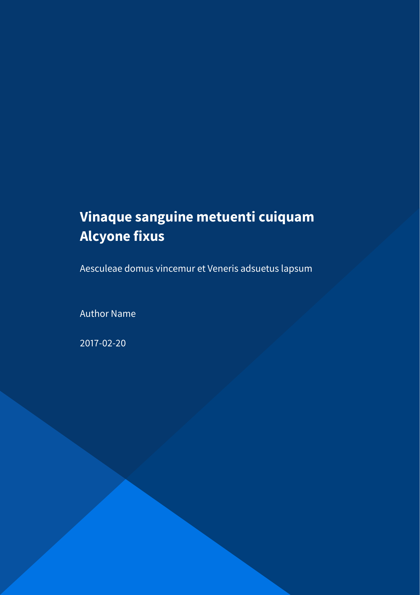
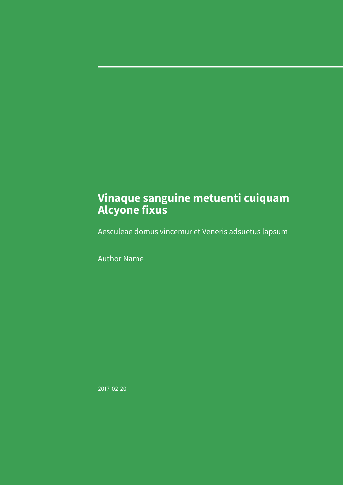
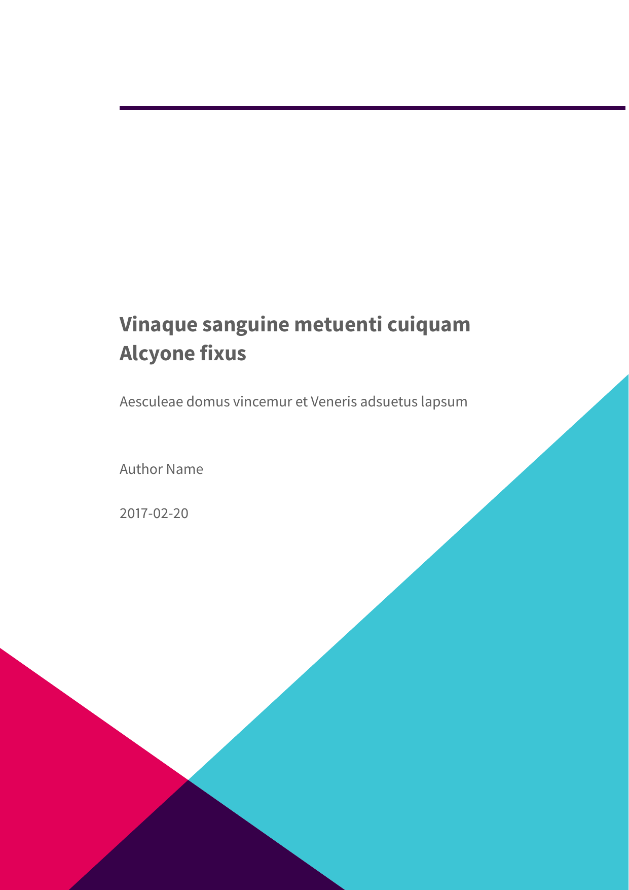
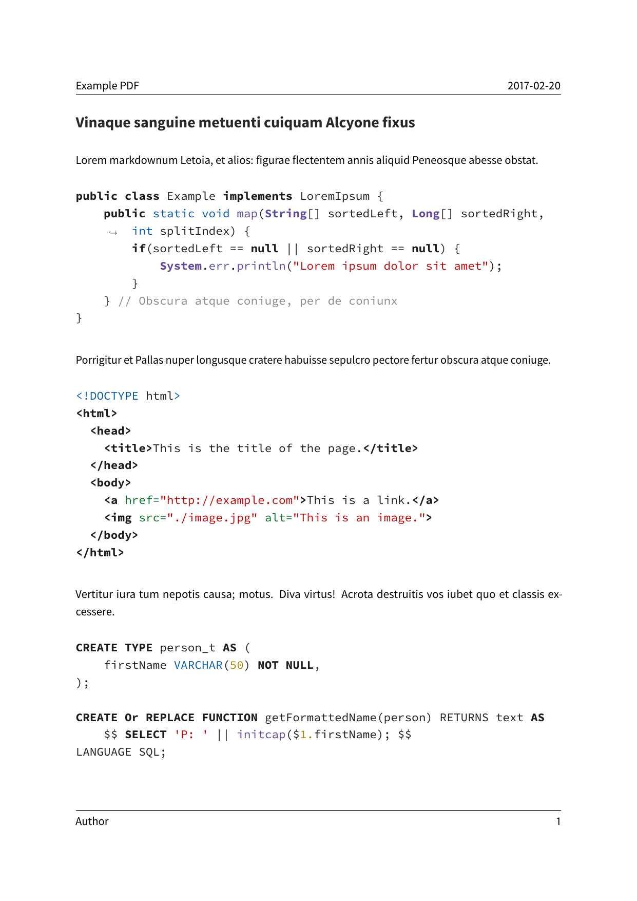
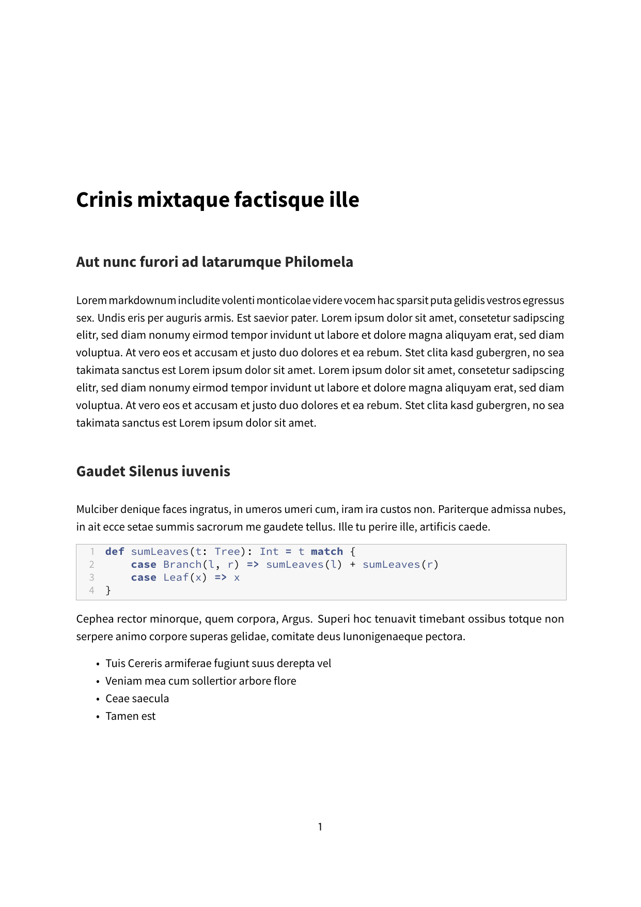
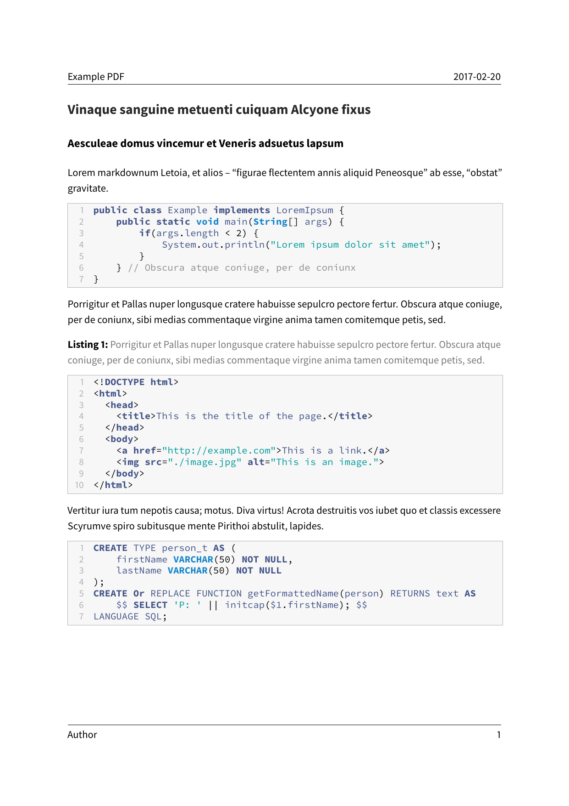
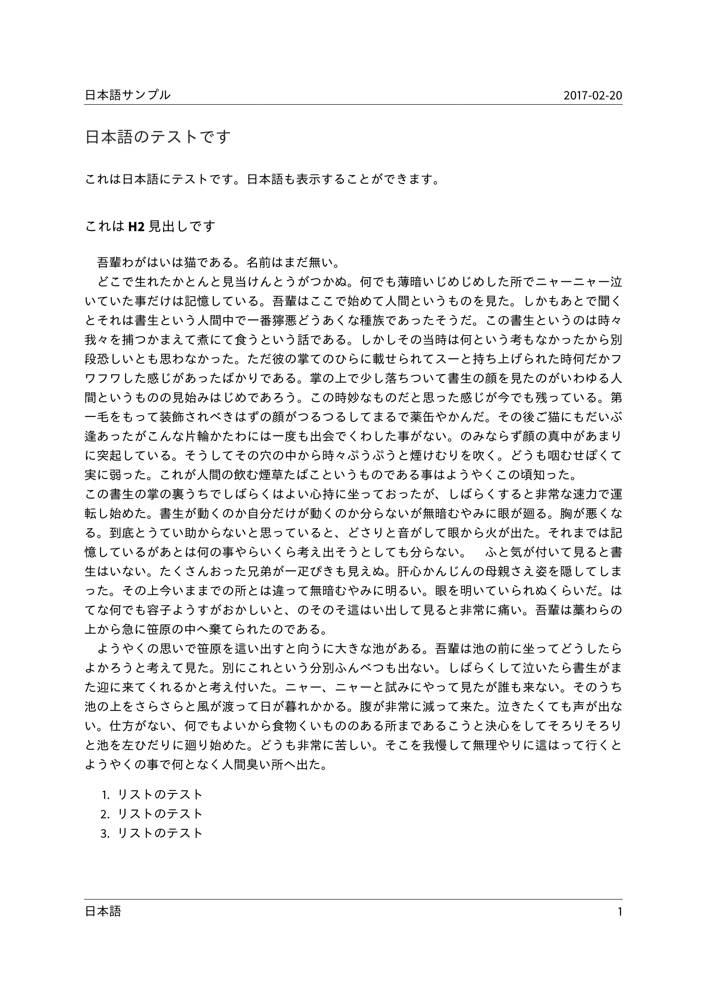

# Eisvogel

[](https://travis-ci.com/Wandmalfarbe/pandoc-latex-template)

A clean **pandoc LaTeX template** to convert your markdown files to PDF or LaTeX. It is designed for lecture notes and exercises with a focus on computer science. The template is compatible with pandoc 2.

## Preview

| A custom title page  | A basic example page |
| :------------------: | :------------------: |
| [](examples/custom-titlepage/custom-titlepage.pdf) | [](examples/basic-example/basic-example.pdf) |

## Installation

1.  Install pandoc from <http://pandoc.org/>. You also need to install [LaTeX](https://en.wikibooks.org/wiki/LaTeX/Installation#Distributions).
2.  Download the latest version of the Eisvogel template from [the release page](https://github.com/Wandmalfarbe/pandoc-latex-template/releases/latest).
3.  Extract the downloaded ZIP archive and open the folder.
4.  Move the template `eisvogel.latex` to your pandoc templates folder. The location of the templates folder depends on your operating system:
      - Unix, Linux, macOS: `/Users/USERNAME/.local/share/pandoc/templates/` or `/Users/USERNAME/.pandoc/templates/`
      - Windows Vista or later: `C:\Users\USERNAME\AppData\Roaming\pandoc\templates\`

    If there are no folders called `templates` or `pandoc` you need to create them and put the template `eisvogel.latex` inside. You can find the default user data directory on your system by looking at the output of `pandoc --version`.

## Usage

1.  Open the terminal and navigate to the folder where your markdown file is located.

2.  Execute the following command

    ``` bash
    pandoc example.md -o example.pdf --from markdown --template eisvogel --listings
    ```

    where `example.md` is the markdown file you want to convert to PDF.

In order to have nice headers and footers you need to supply metadata to your document. You can do that with a [YAML metadata block](http://pandoc.org/MANUAL.html#extension-yaml_metadata_block) at the top of your markdown document (see the [example markdown file](examples/basic-example/basic-example.md)). Your markdown document may look like the following:

``` markdown
---
title: "The Document Title"
author: [Example Author, Another Author]
date: "2017-02-20"
keywords: [Markdown, Example]
...

Here is the actual document text...
```

### Custom Template Variables

This template defines some new variables to control the appearance of the resulting PDF document. The existing template variables from pandoc are all supported and their documentation can be found in [the pandoc manual](https://pandoc.org/MANUAL.html#variables-for-latex).

  - `titlepage` (defaults to `false`)

    turns on the title page when `true`

  - `titlepage-color`

    the background color of the title page. The color value must be given as an HTML hex color like `D8DE2C` without the leading number sign (`#`). When specifying the color in YAML, it is advisable to enclose it in quotes like so `titlepage-color: "D8DE2C"` to avoid the truncation of the color (e.g. `000000` becoming `0`).

  - `titlepage-text-color` (defaults to `5F5F5F`)

    the text color of the title page

  - `titlepage-rule-color` (defaults to `435488`)

    the color of the rule on the top of the title page

  - `titlepage-rule-height` (defaults to `4`)

    the height of the rule on the top of the title page (in points)

  - `titlepage-background`

    the path to a background image for the title page. The background image is scaled to cover the entire page. In the examples folder under `titlepage-background` are a few example background images.

  - `page-background`

    the path to a background image for any page. The background image is scaled to cover the entire page. In the examples folder under `page-background` are a few example background images.

  - `page-background-opacity` (defaults to `0.2`)

    the background image opacity

  - `caption-justification` (defaults to `raggedright`)

    justification setting for captions (uses the `justification` parameter of the [caption](https://ctan.org/pkg/caption?lang=en) package)

  - `toc-own-page` (defaults to `false`)

    begin new page after table of contents, when `true`

  - `listings-disable-line-numbers` (defaults to `false`)

    disables line numbers for all listings

  - `listings-no-page-break` (defaults to `false`)

    avoid page break inside listings

  - `disable-header-and-footer` (default to `false`)

    disables the header and footer completely on all pages

  - `header-left` (defaults to the title)

    the text on the left side of the header

  - `header-center`

    the text in the center of the header

  - `header-right` (defaults to the date)

    the text on the right side of the header

  - `footer-left` (defaults to the author)

    the text on the left side of the footer

  - `footer-center`

    the text in the center of the footer

  - `footer-right` (defaults to the page number)

    the text on the right side of the footer

  - `footnotes-pretty` (defaults to `false`)

    prettifies formatting of footnotes (requires package `footmisc`)

  - `footnotes-disable-backlinks` (defaults to `false`)

    disables making the reference from the footnote at the bottom of the page into a link back to the occurence of the footnote in the main text (enabling requires package `footnotebackref`).

  - `book` (defaults to `false`)

    typeset as book

  - `logo`

    path to an image that will be displayed on the title page. The path is always relative to where pandoc is executed. The option `--resource-path` has no effect.

  - `logo-width` (defaults to `35mm`)

    the width of the logo. One needs to specify the width with a (TeX) unit e.g. `100pt` or `35mm`. The following units can be used:

    - `pt`: Point
    - `pc`: pica (12 `pt`)
    - `in`: inch (72.27 `pt`)
    - `bp`: Big point (72 `bp` = 1 `in`)
    - `cm`: Centimeter
    - `mm`: Millimeter
    - `dd`: Didot point
    - `cc`: cicero (12 `dd`)
    - `sp`: Scaled point (65,536 `sp` = 1 `pt`)
    - `ex`: Nomimal x-height
    - `em`: Nominal m-width
    - `px`: Pixel (only for pdfTeX and LuaTeX) The dimension given to the `\pdfpxdimen` primitive; default value is 1 `bp`, corresponding to a pixel density of 72 dpi.

    A visual overview of the length units is available at <https://github.com/tweh/tex-units>.

  - `first-chapter` (defaults to `1`)

    if typesetting a book with chapter numbers, specifies the number that will be assigned to the first chapter

  - `float-placement-figure` (defaults to `H`)

    Reset the default placement specifier for figure environments to the supplied value e.g. `htbp`. The available specifiers are listed below. The first four placement specifiers can be combined.

    1.  `h`: Place the float *here*, i.e., approximately at the same point it occurs in the source text.
    2.  `t`: Place the float at the *top* of the page.
    3.  `b`: Place the float at the *bottom* of the page.
    4.  `p`: Place the float on the next *page* that will contain only floats like figures and tables.
    5.  `H`: Place the float *HERE* (exactly where it occurs in the source text). The `H` specifier is provided by the [float package](https://ctan.org/pkg/float) and may not be used in conjunction with any other placement specifiers.

  - `table-use-row-colors` (defaults to `false`)

    enables row colors for tables. The default value is `false` because the coloring extends beyond the edge of the table and there is currently no way to change that.

  - `code-block-font-size` (defaults to `\small`)

    LaTeX command to change the font size for code blocks. The available values are `\tiny`, `\scriptsize`, `\footnotesize`, `\small`, `\normalsize`, `\large`, `\Large`, `\LARGE`, `\huge` and `\Huge`. This option will change the font size for default code blocks using the verbatim environment and for code blocks generated with listings.

## Required LaTeX Packages

LaTeX manages addons and additional functionality in so called packages. You
might get the following error when compiling a document with the Eisvogel
template:


``` sh
! LaTeX Error: File `footnotebackref.sty' not found.

Type X to quit or <RETURN> to proceed,
or enter new name. (Default extension: sty)

Enter file name:
! Emergency stop.
<read *>
```

LaTeX informs you that the additional package `footnotebackref` is required to
render the document.

### Texlive

Eisvogel requires a full texlive distribution that can be installed by running
`apt-get install texlive-full` in the terminal. Because `texlive-full` is very
large (about 5 Gigabytes) you can also install the smaller texlive bundles and
add any missing packages manually.

A smaller texlive bundle is `texlive-latex-extra`. With `texlive-latex-extra`
you also need to install these packages manually:

```
adjustbox babel-german background bidi collectbox csquotes everypage filehook
footmisc footnotebackref framed fvextra letltxmacro ly1 mdframed mweights
needspace pagecolor sourcecodepro sourcesanspro titling ucharcat ulem
unicode-math upquote xecjk xurl zref
```

Install them with the following command:

``` sh
tlmgr install adjustbox babel-german background bidi collectbox csquotes everypage filehook footmisc footnotebackref framed fvextra letltxmacro ly1 mdframed mweights needspace pagecolor sourcecodepro sourcesanspro titling ucharcat ulem unicode-math upquote xecjk xurl zref
```

Additional information about the different texlive packages can be found at
this TeX-StackExchange answer: <https://tex.stackexchange.com/a/504566>

### MiKTeX

If you don't want to install all missing packages manually, [MiKTeX might be
an alternative](https://miktex.org/howto/miktex-console).

> MiKTeX has the ability to automatically install missing packages.
> You can turn this feature on or off. And you can let MiKTeX ask you each time a package has to be installed:
>
> - Click `Settings` to navigate to the settings page.
> - Click the `General` tab.
> - Click one of the radio buttons:
>     - `Ask me`
>     - `Always install missing packages on-the-fly`
>     - `Never install missing packages on-the-fly`

## Examples

### Numbered Sections

For PDFs with [numbered sections](http://pandoc.org/MANUAL.html#options-affecting-specific-writers) use the `--number-sections` or `-N` option.

``` bash
pandoc example.md -o example.pdf --template eisvogel --number-sections
```

### Syntax Highlighting with Listings

You can get syntax highlighting of delimited code blocks by using the LaTeX package listings with the option `--listings`. This example will produce the same syntax highlighting as in the example PDF.

``` bash
pandoc example.md -o example.pdf --template eisvogel --listings
```

### Syntax Highlighting Without Listings

The following examples show [syntax highlighting of delimited code blocks](http://pandoc.org/MANUAL.html#syntax-highlighting) without using listings. To see a list of all the supported highlight styles, type `pandoc --list-highlight-styles`.

``` bash
pandoc example.md -o example.pdf --template eisvogel --highlight-style pygments
```

``` bash
pandoc example.md -o example.pdf --template eisvogel --highlight-style kate
```

``` bash
pandoc example.md -o example.pdf --template eisvogel --highlight-style espresso
```

``` bash
pandoc example.md -o example.pdf --template eisvogel --highlight-style tango
```

### Standalone LaTeX Document

To produce a standalone LaTeX document for compiling with any LaTeX editor use `.tex` as an output file extension.

``` bash
pandoc example.md -o example.tex --template eisvogel
```

### Changing the Document Language

The default language of this template is American English. The `lang` variable identifies the main language of the document, using a code according to [BCP 47](https://tools.ietf.org/html/bcp47) (e.g. `en` or `en-GB`). For an incomplete list of the supported language codes see [the documentation for the hyph-utf8 package (Section 2)](http://mirrors.ctan.org/language/hyph-utf8/doc/generic/hyph-utf8/hyph-utf8.pdf). The following example changes the language to British English:

``` bash
pandoc example.md -o example.pdf --template eisvogel -V lang=en-GB
```

The following example changes the language to German:

``` bash
pandoc example.md -o example.pdf --template eisvogel -V lang=de
```

### Typesetting a Book

To typeset a book supply the template variable `-V book` from the command line or via `book: true` in the metadata.

To get the correct chapter headings you need to tell pandoc that it should convert first level headings (indicated by one `#` in markdown) to chapters with the command line option `--top-level-division=chapter`. Chapter numbers start at 1. If you need to change that, specify `first-chapter` in the template variables.

There will be one blank page before each chapter because the template is two-sided per default. So if you plan to publish your book as a PDF and don’t need a blank page you should add the class option `onesided` which can be done by supplying a template variable `-V classoption=oneside`.

### Example Images

| A green title page | A background image on the title page |
| :----------------: | :----------------: |
| [](examples/green-titlepage/green-titlepage.pdf) | [](examples/titlepage-background/titlepage-background.pdf) |

| images and tables | Code blocks styled without listings |
| :---------------: | :---------------: |
| [](examples/images-and-tables/images-and-tables.pdf) | [](examples/without-listings/without-listings.pdf) |

| A book | Code blocks styled with listings |
| :----: | :----: |
| [](examples/book/book.pdf) | [](examples/listings/listings.pdf) |

| A background images on all pages | CJK Support (when using XeLaTeX) |
| :----: | :----: |
| [](examples/page-background/page-background.pdf) | [](examples/japanese/japanese.pdf) |

## Common Errors / Issues

The following section lists common errors and their solutions when using the
Eisvogel template.

### LaTeX Errors `Missing endcsname inserted` or `File x not found` when using `titlepage-background` or `logo`

``` latex
Error producing PDF.
! Missing endcsname inserted.
<to be read again>
                   protect
```

``` latex
Error producing PDF.
! Package pdftex.def Error: File `logo\T1\textunderscoreimage.pdf' not fou
nd: using draft setting.

See the pdftex.def package documentation for explanation.
Type  H <return>  for immediate help.
```

These errors occur when one includes a background image on the title page or a
logo that has an underscore (`_`) in the filename.

A quick fix would be to replace all underscores in the filename of the image
with a hyphen (`-`). If the background image is specified in your YAML front
matter like so,

``` yaml
titlepage-background: "background_image.pdf"
```

you can advise pandoc to interpret this as LaTeX and include it in the document
without parsing.

``` yaml
titlepage-background: "`background_image.pdf`{=latex}"
```

The same fix can be used for the logo image as well:

``` yaml
logo: "`logo_image.pdf`{=latex}"
```

Corresponding issues:

- [Wandmalfarbe/pandoc-latex-template#100](https://github.com/Wandmalfarbe/pandoc-latex-template/issues/100)
- [Wandmalfarbe/pandoc-latex-template#166](https://github.com/Wandmalfarbe/pandoc-latex-template/issues/166)

### LaTeX Error `Missing \begin{document}`

```
! LaTeX Error: Missing \begin{document}.

See the LaTeX manual or LaTeX Companion for explanation.
Type  H <return>  for immediate help.
 ...

l.7 <
     !DOCTYPE html>
!  ==> Fatal error occurred, no output PDF file produced!
```

This error indicates that you try to use some text file for conversion that is
not the Eisvogel template. Please download the [latest Eisvogel template](https://github.com/Wandmalfarbe/pandoc-latex-template/releases/latest) from the releases page and start the conversion again.

### LaTeX Error `auto expansion is only possible with scalable fonts`

``` latex
Error producing PDF.
! pdfTeX error (font expansion): auto expansion is only possible with scalable
fonts.
\AtBegShi@Output ...ipout \box \AtBeginShipoutBox
                                                  \fi \fi
l.643 \begin{lstlisting}
```

This error likely occurs on Windows with MiKTeX installed. StackOverflow user
[Krebto provided the following fix](https://tex.stackexchange.com/a/392467):

> To solve the problem navigate to `C:\Program Files\MiKTeX 2.9\miktex\bin\x64` and run `updmap.exe`. The program may seem as it hangs for a while, but its probably because it tries to update the whole font tree. This solved the problem for me. After re-compiling everything should work fine.

Corresponding issue:

- [Wandmalfarbe/pandoc-latex-template#133](https://github.com/Wandmalfarbe/pandoc-latex-template/issues/133)

### LaTeX Error `cannot find image file`

``` latex
Error producing PDF.
! error:  (file "/tmp/tex2pdf.-be734e802ef6d0c3/""fdcfc29edcf252186f1b0a52f18f50
43abaeb2d0".png) (pdf backend): cannot find image file '"/tmp/tex2pdf.-be734e802
ef6d0c3/""fdcfc29edcf252186f1b0a52f18f5043abaeb2d0".png'
!  ==> Fatal error occurred, no output PDF file produced!
```

In general this error means that LaTeX is unable to find the included image
file. Please check all image references and file names for correctness.

This error also occurs if you use an old version of Eisvogel with the package
`grffile` and have an old LaTeX distribution installed. Please update Eisvogel
and your LaTeX distribution.

Corresponding issues:

- [jgm/pandoc#5848](https://github.com/jgm/pandoc/issues/5848)
- [Wandmalfarbe/pandoc-latex-template#149](https://github.com/Wandmalfarbe/pandoc-latex-template/issues/149)

## Credits

  - This template includes code for styling block quotations from [pandoc-letter](https://github.com/aaronwolen/pandoc-letter) by [Aaron Wolen](https://github.com/aaronwolen).

## License

This project is open source licensed under the BSD 3-Clause License. Please see the [LICENSE file](LICENSE) for more information.
