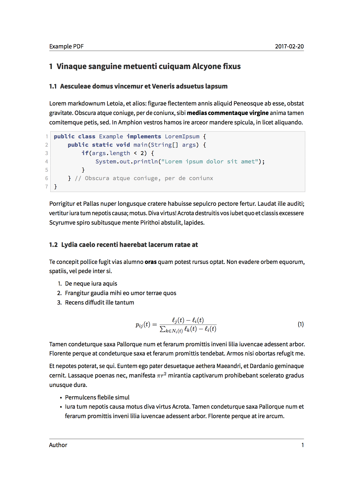

# Eisvogel pandoc LaTeX template

A clean pandoc LaTeX template to convert your markdown files to PDF or LaTeX.



## Installation

1. Install pandoc from <http://pandoc.org/>. You also need to install [LaTeX](https://en.wikibooks.org/wiki/LaTeX/Installation#Distributions).
2. Move the template `eisvogel.latex` to your pandoc templates folder at `~/.pandoc/templates/`.

## Usage

1. Open the terminal and navigate to the folder where your markdown file is located.
2. Execute the following command
    
    ```bash
    pandoc Myfile.md -o Myfile.pdf --from markdown --template eisvogel --listings --latexmathml
    ```
    
    where `MyFile.md` is the markdown file you want to convert to PDF.

In order to have nice headers and footers you need to supply metadata to your Document. You can do that with a [YAML metadata block](http://pandoc.org/MANUAL.html#extension-yaml_metadata_block) at the top of your markdown document (see the [example markdown file](example/example.md)). Your markdown document may look like the following:

```markdown
---
title: "The Document Title"
author: [Example Author, Another Author]
date: 2017-02-20
tags: [Markdown, Example]
...

Here is the actual document text...
```